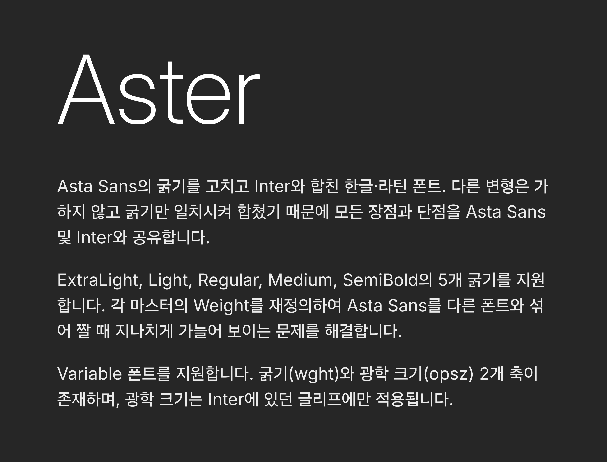

# Aster

Aster is a combined typeface built from [Asta Sans](https://github.com/42dot/Asta-Sans)
and [Inter](https://github.com/rsms/inter). Asta Sans provides the base font,
while Inter is overlaid at matching weight and optical-size coordinates.

Where both projects contain the same glyph or OpenType functionality, Aster
uses Inter's outlines, kerning, classes, and feature definitions. Glyphs and
OpenType features that exist only in Asta Sans are retained.

## Creating the Aster source

The input package is `sources/Aster.glyphspackage`: it has that filename but
initially contains the original Asta Sans project. To turn it into the complete
Aster project in place, run:

```sh
make init-aster
```

This sets the Aster family, master, and export names and coordinates; makes the
400 Regular master the variable-font default; adds the `opsz` axis and Display
masters/exports; applies Aster's copyright, designer/manufacturer, URL, license,
and `QPLE` vendor metadata; and fetches and merges the latest Inter source.

## Synchronizing Inter

Inter is stored in `sources/Aster.glyphspackage`, not merged during every
font build. Run this command whenever the Inter source should be updated:

```sh
make sync-inter
```

The command fetches the current default branch of the official `rsms/inter`
repository, caches it in the gitignored `sources/vendor/inter/` directory, and
then updates the Aster Glyphs package. When the fetched commit has changed,
only package files whose generated contents differ are replaced. It does not
read a sibling checkout.

To discard the previous imported Inter glyphs and reapply every Inter glyph,
kerning pair, and matching OpenType layout definition even when the Inter
commit has not changed, run:

```sh
make sync-inter-all
```

This is a full logical reimport; files whose resulting bytes are identical are
still left untouched.

To synchronize from a fork instead, pass its git URL:

```sh
make sync-inter INTER_REPOSITORY_URL=https://github.com/example/inter.git
```

At each of Aster's six weight-master coordinates, Inter is interpolated at
the Text (`opsz=14`) and Display (`opsz=32`) endpoints. Inter glyphs replace
same-named Aster glyphs, Unicode conflicts are assigned to Inter, and Inter
OpenType features/classes/kerning replace matching Aster data. Aster-only
features such as `vert`, `fwid`, and `vrt2` remain.

After synchronization, the regular `make build` command uses only the merged
Glyphs package and performs no network access. The variable font contains both
`opsz` and `wght`. Static TTF and OTF fonts are built as the `Aster` Text family
at `opsz=14` and the separate `Aster Display` family at `opsz=32`.
